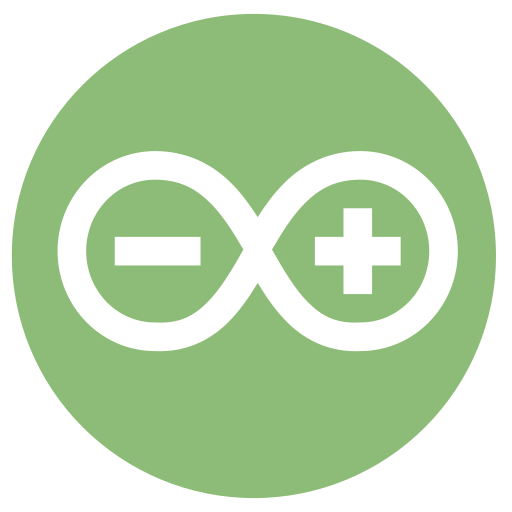

## Arduino++ / Arduino Simulator
### Developed by Gabriel Margarido
Visit project official website: [arduinopp.gabrielmargarido.org](http://arduinopp.gabrielmargarido.org)

 

### - Arduino Simulator  
Configure: `cd simulator && npm install`  

#### Build from sources
Apple MacOS: `./build-macos.sh`  
Linux: `./build-linux.sh`  
Windows: `start build-win.bat`     

### - Arduino++ Compiler
Configure: `cd compiler && npm install`  

#### Build from sources
Apple MacOS / Linux: `./build.bash`  
Windows: `build.bat`   

### - Install VSCode Extension Support (Microsoft)  
macOS/Linux `./install-vscode.sh`  
Windows: `install-vscode.bat`  

### - Install VSCode Extension Support (VSCodium)  
macOS/Linux `./install-oss.sh`  
Windows: `install-oss.bat`  
